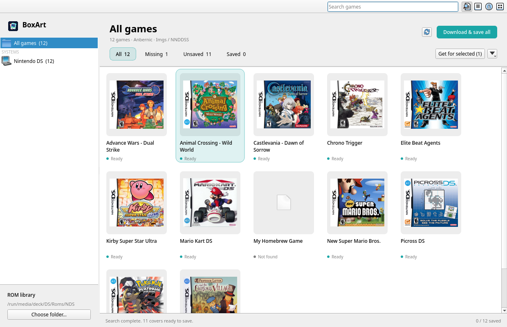

# BoxArt for Linux

A Linux port of [BoxArt](https://github.com/abradburne/boxart), a desktop app for finding and exporting multi-system cover art for handheld ROM libraries. It is written in Python with Qt (PySide6) and Pillow, and needs no API keys. It runs on X11 and Wayland, on KDE, GNOME and other desktops.



## Install

Requires Python 3.10+.

```sh
./install.sh
```

This creates a virtualenv in `~/.local/share/boxart/venv`. It reuses your distribution’s PySide6 and Pillow when they are installed (e.g. `sudo pacman -S pyside6 python-pillow` or `sudo apt install python3-pyside6.qtwidgets python3-pil`) and otherwise installs them from PyPI. It also links `boxart` into `~/.local/bin` and adds BoxArt to your application menu. To uninstall, delete `~/.local/share/boxart`, `~/.local/bin/boxart`, `~/.local/share/applications/io.github.polyspade.BoxArt.desktop` and `~/.local/share/icons/hicolor/scalable/apps/io.github.polyspade.BoxArt.svg`.

To run it without installing:

```sh
python3 -m venv .venv && .venv/bin/pip install -e .
.venv/bin/boxart        # or: .venv/bin/python -m boxart
```

## Use

On first launch, BoxArt scans `/run/media/$USER/*/Roms/NDS` (falling back to `/media/$USER/…` and `/mnt/…`) without changing anything. Use **Choose folder** (Ctrl+O) to pick another library; Ctrl+R rescans. **Download & save all** fetches and exports missing covers for the whole scanned library in one run. The More menu (▾) can download previews without saving, or save ready covers separately. The sidebar filters by system. The toolbar has search (Ctrl+F), grid/list view, the details inspector and artwork settings (Ctrl+,).

Click a cover, then Shift-click another to select a range. Ctrl-click adds or removes individual games. **Get for selected** downloads and saves only that selection. Right-click a cover for Show in Files, Show Info, Find Image, Search Images Online, Import Image and Save Image. Show in Files highlights the file through the freedesktop FileManager1 D-Bus interface (Dolphin, Nautilus, Nemo, Thunar…), or opens the folder if that is unavailable. Actions apply to the clicked game. Saved artwork stays protected, so finding or importing is only offered for games without saved covers. Changing the search, system or status filter removes hidden games from the selection; a batch already running keeps its original selection. ROM contents are never modified. With filename normalization off (the default), ROM filenames stay unchanged, and existing PNG/JPEG covers are always kept.

## Profiles

- **RG DS Plus / NNDDSS**: `Imgs/<exact ROM stem>.png` beside each ROM, including nested folders. PNG, default maximum edge 512 pixels, no cropping or stretching. A 512 × 458 cover was tested successfully on RG DS Plus / NNDDSS. The folder and filename convention is community-reported; this is not an official size specification. Size is configurable.
- **TWiLight Menu++**: choose the SD root as the destination. Exports `_nds/TWiLightMenu/boxart/<full ROM filename>.png`, fitted within 128 × 115 pixels. Intended for normal box-art mode; the Cached mode's separate 44 KiB limit is not enforced.
- **Custom folder**: choose the output folder, PNG/JPEG and maximum edge. Uses ROM stems. This supports other frontends with compatible layouts, but does not generate their databases, playlists or gamelist.xml files.

## RetroArch and other systems

Choose your card’s `Roms` folder (e.g. `/run/media/$USER/DS/Roms`) to scan across system folders. Supports DS, GBA, GB/GBC, NES/FDS, SNES, N64, PlayStation, PSP, Mega Drive, Master System, Game Gear, Dreamcast, Saturn, Sega CD/32X, PC Engine, Atari 2600/Lynx, Neo Geo Pocket/Color and WonderSwan/Color. Disc images and ZIP/7z archives are identified by their enclosing system folder (e.g. `PS`, `GBA`, `SFC`); archives are matched by filename, not unpacked. BIN files are skipped in folders with CUE/GDI descriptors to avoid treating audio tracks as games.

For **RetroArch**, choose the directory configured as **Settings → Directory → Thumbnails** on your handheld. Export uses `<system>/Named_Boxarts/<label>.png`. Import JSON `.lpl` playlists to get exact display labels and database names. Android/Linux paths are matched to local ROMs by unique basename; ambiguous names are skipped. Without a playlist, the app uses standard Libretro system names and ROM stems, which only works if your playlist labels match. Import playlists again after rescanning. Legacy six-line playlists are not supported.

Other frontend layouts can use Anbernic `Imgs` or Custom folder export. Emulator-specific databases and gamelist.xml are not generated, and universal compatibility is not claimed.

## Matching

Reads only the four-byte game code at offset 0x0C from `.nds` and `.dsi` headers. Tries the appropriate Libretro system’s box art with exact filename matching and Libretro character substitutions first. Falls back to GameTDB medium front covers using the exact DS game code, trying the ROM region first, then small covers. No fuzzy matching that might confuse sequels. Translations keep their underlying game code. Homebrew and unrecognized titles can use **Import image**. Non-DS and archived games use Libretro filename/playlist-label matching.

Downloads remain in memory until saved. Stop preserves completed downloads for the current session. Network failures appear per game and can be retried with Find Image or Download & save all. Artwork is written through a temporary sibling file and moved into place; existing artwork is never replaced. Flat destinations are checked for duplicate names before the batch writes. Filesystem failures appear per game. Reconnect/rescan after disconnecting a card. Close and reopen discards unsaved previews.

## Build and test

```sh
python3 -m venv .venv && .venv/bin/pip install -e . pytest
.venv/bin/pytest                        # offline tests
BOXART_LIVE_TEST=1 .venv/bin/pytest     # also hits Libretro, GameTDB and GitHub
```

`boxart/library.py`, `systems.py`, `normalization.py` and `artwork.py` hold the scanner, image conversion, providers and export rules. `model.py` holds application state and background jobs, and `app.py` the Qt widgets. The tests cover hidden-file filtering, header reads, exact naming, dimensions, preservation of ROMs and existing images, invalid images, disconnected cards, playlist matching, selection and batch export.

## Differences from the macOS app

- Files are moved into place with `renameat2(RENAME_NOREPLACE)`, so existing artwork or ROMs are never overwritten, even on FAT/exFAT cards. On filesystems without it, BoxArt checks before renaming instead.
- Libretro covers that are git symlinks (common for multi-disc games) are followed, so e.g. `Final Fantasy VII (USA) (Disc 1)` finds its cover.
- RetroArch’s suggested thumbnails folder detects `/run/media/<user>/<card>`, `/media/<user>/<card>` and `/mnt/<card>` volume roots.
- The ROM folder and filename-normalization settings are stored with QSettings (`~/.config/BoxArt/BoxArt.conf`).

## Icon

`boxart/data/io.github.polyspade.BoxArt.svg` is a flattened version of the original layered Icon Composer icon, which is kept in `data/BoxArt.icon`.

Artwork quality: Libretro exact-name covers are tried first, followed by GameTDB medium covers matched by DS game code, then small covers as a last resort. The exporter never upscales; a larger maximum edge only preserves detail already present in the source. Existing saved covers remain protected and are not automatically replaced. RetroArch export suggests `RetroArch/thumbnails` beside the selected Roms directory (or at the root of the removable volume), reusing common existing thumbnail folders when present. Saving creates the directories.

## Filename normalization

Settings → **Normalize filenames when processing** is off by default. When enabled, downloaded artwork with a unique normalized title/region match allows the ROM to be renamed to the artwork database name, preserving its extension. Scene tags and underscores are removed for matching; no fuzzy sequel guesses are made. Already-covered games, collisions, RetroArch/imported playlist mappings, and folders containing CUE/GDI/M3U files are excluded from renaming. A hidden `.boxart-renames.jsonl` log beside the ROMs records intended old/new names; an unsuccessful move can leave a log entry without a renamed file. External playlists elsewhere are not discovered; leave this option off for libraries referenced by them.

The **Unsaved** filter contains downloaded/imported previews held in memory, with a button to save the displayed covers. Filter counts follow the selected system and search.

## References and credits

- [GameTDB](https://www.gametdb.com/) — Nintendo DS artwork, exact game-code lookup.
- [Libretro thumbnails](https://github.com/libretro-thumbnails/libretro-thumbnails) — fallback artwork and naming conventions.
- [TWiLight Menu++ box-art documentation](https://wiki.ds-homebrew.com/twilightmenu/how-to-get-box-art) — PNG naming and size limits.
- [RG DS Plus owners reporting the Imgs convention](https://www.reddit.com/r/ANBERNIC/comments/1wnvhxj/rg_ds_plus_received_and_its_great/) — community evidence, not an official NNDDSS specification.
- [RetroArch thumbnail documentation](https://docs.libretro.com/guides/roms-playlists-thumbnails/) — playlist labels, database names and folder conventions.

Artwork belongs to its respective rights holders. No ROMs or cover images are bundled.

## License

BoxArt's original source code, documentation, and app icon are licensed under the [MIT License](LICENSE), copyright 2026 XenoCode. Downloaded game artwork, game metadata, ROMs, and third-party service content are excluded from this license and remain subject to their respective rights and provider terms. MIT permits commercial reuse of the code; it does not grant access to artwork services or override their noncommercial restrictions.
